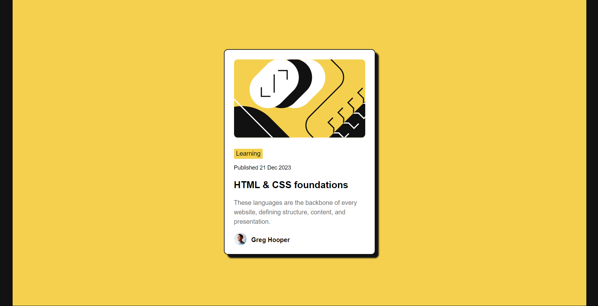

# Frontend Mentor - Blog preview card solution

This is a solution to the [Blog preview card challenge on Frontend Mentor](https://www.frontendmentor.io/challenges/blog-preview-card-ckPaj01IcS).

## Table of contents

- [Overview](#overview)
  - [The challenge](#the-challenge)
  - [Screenshot](#screenshot)
  - [Links](#links)
- [My process](#my-process)
  - [Built with](#built-with)
  - [What I learned](#what-i-learned)
  - [Useful resources](#useful-resources)
- [Author](#author)

## Overview

### The challenge

Users should be able to:

- See hover and focus states for all interactive elements on the page

### Screenshot

### Links

- Solution URL: (https://github.com/omniaEE/where-to-start/tree/main/04)
- Live Site URL: wait for this

## My process

### Built with

- Semantic HTML5 markup
- scss
- Flexbox
- Mobile-first workflow
- BEM (not perfectly)

### What I learned

- variable fonts
  it was my first time hear about so I searched about and it's (in simple way ) multiple styles, weights, and widths within a single file
  I used google fonst before but I did not know that's variable font
- BEM
  which is an abrouch or way to make more organized code

### Useful resources

- [Variable fonts](https://youtu.be/0fVymQ7SZw0?si=vKmku7kMRXV668LK) - This helped me alot to understand Variable fonts.
- [BEM 101](https://youtu.be/tha_ynmZRaA?si=suQ1IxyauTWz0h-l) - This is a good video which helped me to organize my code.

## Author

- Website - [My website](https://omniaee.netlify.app/)
